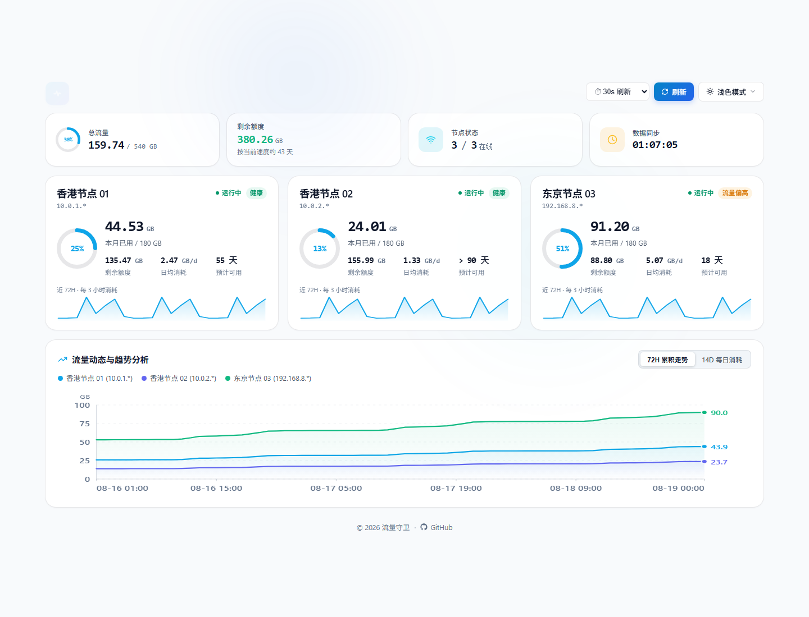

<div align="center">


# 流量守卫

**阿里云 CDT 出网流量监控与自动保护面板**

实时查看流量额度、消耗趋势与节点状态，并在达到安全阈值时自动停止 ECS，降低意外超额风险。

<br/>

多节点 · 72H / 14D 趋势 · 阈值保护 · Docker 部署

<br/>

[](https://traffic.honkai3rd.eu.org)
[](#快速开始)

<br/>

[](https://github.com/uncat2310/aliyun-cdt-traffic-guard/actions)
[](LICENSE)
[](https://github.com/uncat2310/aliyun-cdt-traffic-guard/stargazers)
[](https://github.com/uncat2310/aliyun-cdt-traffic-guard/pkgs/container/aliyun-cdt-traffic-guard)

<br/>

<a href="https://traffic.honkai3rd.eu.org">
  
</a>

<br/>

<sub>Demo 使用示例数据，仅用于界面展示。</sub>

</div>

---

## 功能

- **流量监控**：按节点展示当月已用、剩余额度、日均消耗和预计可用天数。
- **趋势分析**：72H 累积趋势与 14D 每日消耗，支持 Hover 查看明细。
- **多节点**：每台节点可配置独立地域、阈值和 AccessKey。
- **自动保护**：达到安全阈值自动停止 ECS，并支持条件满足后自动启动。
- **Dashboard**：响应式设计，支持浅色、深色和跟随系统。

## 快速开始

1. 准备一台**长期在线**的 Linux 主机，并安装 Docker / Docker Compose。
2. 创建阿里云 RAM 子用户，拿到 AccessKey、ECS 实例 ID 和地域。
3. 克隆仓库，生成并编辑 `config.json`。
4. 启动容器。

```bash
git clone https://github.com/uncat2310/aliyun-cdt-traffic-guard.git
cd aliyun-cdt-traffic-guard

cp backend/config.example.json config.json
nano config.json

docker compose up -d
docker compose ps
docker compose logs -f
```

浏览器访问：

```text
http://服务器IP:8388
```

默认监听 `0.0.0.0:8388`，**没有内置登录认证**。不要把 8388 无限制地暴露到公网。详见 [部署前须知](#部署前须知)。

## 部署前须知

### 长久在线机器

流量守卫应安装在：

> 一台不会被守卫关闭的长期在线机器。

不要安装在自己要自动关机保护的那台 ECS 上。目标机关闭后，守卫也会一起停下。

容器启动后会自动跑后端：提供网页、查询阿里云、写历史、按阈值开关机。不需要再手动执行 Python 脚本。

`restart: unless-stopped` 表示容器崩溃会重启；**主机重启后，只要 Docker 服务本身会开机启动，这个容器也会跟着起来。** Linux 安装 Docker 后通常已经是开机自启。

### 公网访问

当前 Dashboard：

- 默认绑定 `0.0.0.0:8388`
- 无用户名 / 密码
- 无内置 HTTPS

暴露到公网会让他人看到 Dashboard、节点状态、流量和部分实例信息。不建议把 8388 对整个互联网开放。

推荐：安全组限制来源、ufw / nftables、Tailscale / WireGuard，或用 Nginx / Caddy 做 HTTPS 和反向代理认证。

### AccessKey

- 只用 RAM 子用户，不要用主账号 AK
- 权限按下方最小够用原则配置
- `config.json` 已在 `.gitignore` 中，不要提交到 Git
- 建议 `chmod 600 config.json`
- 不要把 AK/SK 发到 Issue、截图或 README

## 工作原理

```text
Aliyun CDT / ECS / VPC API
          ↓
 Traffic Guard Backend
    ├─ 查询当月 CDT 流量
    ├─ 查询 ECS 状态
    ├─ 写入历史日志
    ├─ 与 threshold_gb 比较
    └─ 必要时 Start / Stop ECS
          ↓
     React Dashboard
```

AccessKey 只在服务端 `config.json` 中使用，浏览器不会直接访问阿里云 API。

三种间隔不要混为一谈：

| | 默认 | 作用 |
| --- | --- | --- |
| 后端轮询 | 约 12 秒 | 刷新内存中的用量和状态 |
| `guard_interval_seconds` | 60 秒 | 写历史，并决定是否开关机 |
| 页面刷新 | 30 秒 | 浏览器重新拉取展示数据 |

改网页上的刷新间隔，不会改变后端守卫的 60 秒检查。

## 完整部署

官方镜像：

```text
ghcr.io/uncat2310/aliyun-cdt-traffic-guard:latest
```

公开包一般可以直接拉取，不必登录。只有拉取失败时才需要 `docker login ghcr.io`，或到仓库 Packages 把该镜像设为 Public。

### RAM 与 ECS

打开 [RAM 用户](https://ram.console.aliyun.com/users)，新建用户并创建 AccessKey。再到 [ECS 实例列表](https://ecs.console.aliyun.com/server/region/cn-hongkong) 复制实例 ID 和地域 ID。

#### 简单方式

授予托管策略：

- `AliyunCDTFullAccess`
- `AliyunECSFullAccess`
- `AliyunVPCReadOnlyAccess`（用于查询共享带宽包；没有时流量监控仍可用）

#### 最小权限

程序实际会调用：

| Action | 用途 |
| --- | --- |
| `cdt:ListCdtInternetTraffic` | 查询当月 CDT 出网流量 |
| `ecs:DescribeInstances` | 查询实例状态 |
| `ecs:StartInstances` | 低于阈值时开机（若开启） |
| `ecs:StopInstances` | 达到阈值时关机 |
| `vpc:DescribeCommonBandwidthPackages` | 自动识别 CBWP 带宽 |

没有 VPC 权限时：CDT 监控和开关机仍可工作；带宽自动识别可能失败。需要时可在配置里写死 `bandwidth_mbps`。面板当前不展示带宽数值。

### 方式 A：已有源码（推荐 Compose）

```bash
cd aliyun-cdt-traffic-guard
cp backend/config.example.json config.json
nano config.json
docker compose up -d
```

目录：

```text
aliyun-cdt-traffic-guard/          ← 在这一层执行 docker compose
├── docker-compose.yml             ← 仓库自带
├── config.json                    ← 复制模板后填写
├── history/                       ← 第一次启动后出现
├── backend/
│   └── config.example.json
├── frontend/
└── Dockerfile
```

`docker-compose.yml` 会拉取官方镜像，只读挂载 `./config.json`，并把 `./history` 持久化到宿主机。更新容器一般不会丢掉趋势数据；删除宿主机 `history/` 会丢历史。`history/` 不应提交 Git。

```bash
docker compose logs -f
docker compose pull && docker compose up -d
docker compose down
```

本地构建：`docker compose up -d --build`。

### 方式 B：空文件夹 + docker run

不克隆仓库也可以：

```text
traffic-guard/
├── config.json
└── history/
```

```bash
mkdir -p ~/traffic-guard/history
cd ~/traffic-guard
# 自行新建并编辑 config.json

docker pull ghcr.io/uncat2310/aliyun-cdt-traffic-guard:latest
docker run -d \
  --name aliyun-traffic-guard \
  --restart unless-stopped \
  -p 8388:8388 \
  -v "$PWD/config.json:/app/config.json:ro" \
  -v "$PWD/history:/app/history" \
  ghcr.io/uncat2310/aliyun-cdt-traffic-guard:latest
```

## 配置

与 `backend/config.example.json` 对齐。

### 基础配置

```json
{
  "host": "0.0.0.0",
  "port": 8388,
  "guard_enabled": true,
  "guard_auto_start": true,
  "guard_interval_seconds": 60,
  "servers": {
    "hk-01": {
      "id": "hk-01",
      "name": "香港节点 01",
      "masked_ip": "10.0.1.*",
      "instance_id": "i-xxxxxxxxxxxxxxxxx",
      "region_id": "cn-hongkong",
      "ak": "YOUR_ALIYUN_ACCESS_KEY_ID",
      "sk": "YOUR_ALIYUN_ACCESS_KEY_SECRET",
      "threshold_gb": 180
    }
  }
}
```

| 字段 | 说明 |
| --- | --- |
| `name` | 面板上的显示名 |
| `masked_ip` | 面板展示的脱敏 IP |
| `instance_id` | ECS 实例 ID |
| `region_id` | 实例地域 |
| `ak` / `sk` | 该节点使用的 RAM AccessKey |
| `threshold_gb` | **安全保护阈值（GB）**，不是套餐上限本身 |

`threshold_gb` 建议低于实际月度额度，给统计延迟和突发流量留余量。例如额度为 200GB 时，可设 `180`，预留约 20GB。`180` 只是示例，按自己的额度改。

### 多节点

每台可以使用不同 Region、不同阈值、不同 AccessKey：

```json
{
  "host": "0.0.0.0",
  "port": 8388,
  "guard_enabled": true,
  "guard_auto_start": true,
  "guard_interval_seconds": 60,
  "servers": {
    "hk-01": {
      "id": "hk-01",
      "name": "香港节点 01",
      "masked_ip": "10.0.1.*",
      "instance_id": "i-xxxxxxxxxxxxxxxxx",
      "region_id": "cn-hongkong",
      "ak": "YOUR_ALIYUN_ACCESS_KEY_ID",
      "sk": "YOUR_ALIYUN_ACCESS_KEY_SECRET",
      "threshold_gb": 180,
      "guard_enabled": true
    },
    "jp-01": {
      "id": "jp-01",
      "name": "东京节点 01",
      "masked_ip": "10.0.2.*",
      "instance_id": "i-yyyyyyyyyyyyyyyyy",
      "region_id": "ap-northeast-1",
      "ak": "ANOTHER_ACCESS_KEY_ID",
      "sk": "ANOTHER_ACCESS_KEY_SECRET",
      "threshold_gb": 150,
      "guard_enabled": true
    }
  }
}
```

只有一台时，`servers` 里只留一个节点。未改完的占位值（`YOUR_ALIYUN_*`、`i-xxxxxxxx` 等）会被忽略。

### 高级配置

一般无需修改。

| 字段 | 默认 | 说明 |
| --- | --- | --- |
| `host` / `port` | `0.0.0.0` / `8388` | 监听地址 |
| `node_tag` | `Guard-Master` | 后端节点标签 |
| `history_dir` | `history` | 未指定 `log_files` 时的历史目录 |
| `guard_enabled` | `true` | 全局是否执行开关机 |
| `guard_auto_start` | `true` | 全局是否在低于阈值时自动开机 |
| `guard_interval_seconds` | `60` | 守卫检查间隔（最短 15 秒） |
| `servers.<id>.guard_enabled` | `true` | 单节点可单独关闭守卫 |
| `servers.<id>.guard_auto_start` | 跟随全局 | 单节点可单独关闭自动开机 |
| `servers.<id>.bandwidth_mbps` | `0` | `0` 表示自动探测：配置值 → ECS/EIP → CBWP |
| `servers.<id>.log_files` | `[]` | 留空则写到 `history/<id>.log` |

## 自动保护

判定与常见 CDT 脚本相同：查询 `ListCdtInternetTraffic`，当月总量 ≥ `threshold_gb` 则停止该实例，否则在允许时启动。查询失败这一轮不动机器。

> 如果希望某台实例手动关机后长期保持关闭，请把该节点的 `guard_auto_start` 设为 `false`（或关闭该节点 / 全局的守卫）。否则流量仍低于阈值时，Guard 会把它重新启动。这是设计行为，不是缺陷。

## 常见问题

**面板上没有节点**  
`ak` / `sk` / `instance_id` 仍是 `YOUR_ALIYUN_*`、`i-xxxxxxxx` 这类占位值时会被跳过。

**报 AccessDenied**  
检查 AccessKey、RAM 策略、实例地域是否与 `region_id` 一致。

**日志里有 CBWP query failed**  
缺少 `vpc:DescribeCommonBandwidthPackages`。流量监控和开关机不受影响；需要带宽识别时补权限，或设置 `bandwidth_mbps`。

**有页面但趋势是空的**  
新安装需要运行一段时间才会积累 72H / 14D 数据，不会一启动就出现过去两周的真实曲线。

**我手动关机后实例又被打开**  
`guard_auto_start` 仍为 `true`，且用量低于阈值。按上一节关闭自动开机。

**主机重启后容器没起来**  
确认 Docker 服务已开机启动：`systemctl status docker`，再看 `docker ps -a` 和 `docker compose logs`。

**拉不下 GHCR 镜像**  
包若为私有，先设为 Public，或 `docker login ghcr.io` 后再拉。

**公网打不开页面**  
检查安全组、本机防火墙和 `8388`。同时不要对 `0.0.0.0/0` 无保护开放。

## 源码运行

```bash
cd frontend && npm install && npm run build && cd ..
cp -R frontend/dist backend/dashboard_dist
cd backend
python3 -m venv .venv && source .venv/bin/activate
pip install -r requirements.txt
cp config.example.json config.json
python monitor_service.py
```

## 技术栈

Python 3.10+ · React 19 · Docker · GitHub Container Registry

---

<div align="center">

[在线 Demo](https://traffic.honkai3rd.eu.org) · [MIT License](LICENSE)

</div>
